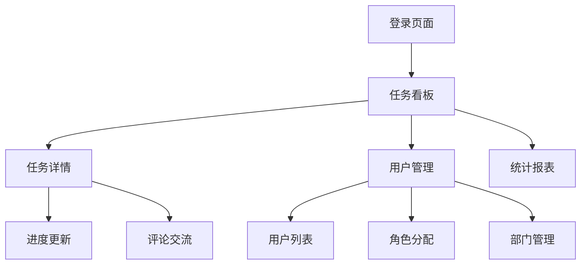

## 1. 产品概述
任务管理OA系统是一个专为企业设计的办公自动化平台，专注于提升团队协作效率和任务执行透明度。
系统通过任务分配、进度跟踪、用户角色管理等功能，帮助企业实现高效的任务流转和团队协作，适用于各类企业的日常办公管理需求。

## 2. 核心功能

### 2.1 用户角色
| 角色 | 注册方式 | 核心权限 |
|------|----------|----------|
| 普通员工 | 管理员创建账号 | 接收任务、更新进度、查看个人任务 |
| 部门主管 | 管理员创建账号 | 分配任务、查看部门任务、审批申请 |
| 系统管理员 | 初始账号 | 用户管理、系统配置、数据备份 |

### 2.2 功能模块
系统包含以下核心页面：
1. **登录页面**：用户认证、密码重置、记住登录状态。
2. **任务看板**：任务列表展示、任务状态筛选、快速创建任务。
3. **任务详情**：任务信息展示、进度更新、评论交流、附件管理。
4. **用户管理**：用户列表、角色分配、权限设置、部门管理。
5. **统计报表**：任务完成情况、部门效率分析、个人绩效统计。

### 2.3 页面详情
| 页面名称 | 模块名称 | 功能描述 |
|----------|----------|----------|
| 登录页面 | 用户认证 | 输入用户名密码进行登录，支持记住登录状态和密码重置功能。 |
| 任务看板 | 任务列表 | 以卡片形式展示所有任务，支持按状态、优先级、负责人筛选。 |
| 任务看板 | 快速创建 | 提供快速创建任务的弹窗，包含任务标题、描述、负责人等基本信息。 |
| 任务详情 | 任务信息 | 展示任务完整信息，包括标题、描述、截止日期、优先级、附件等。 |
| 任务详情 | 进度更新 | 支持更新任务状态（待办、进行中、已完成），添加进度说明。 |
| 任务详情 | 评论交流 | 提供任务讨论功能，支持文字评论和@提醒功能。 |
| 用户管理 | 用户列表 | 展示所有用户信息，支持搜索、筛选、分页功能。 |
| 用户管理 | 角色分配 | 管理员可以为用户分配不同角色和权限。 |
| 用户管理 | 部门管理 | 创建和管理部门结构，设置部门负责人。 |
| 统计报表 | 任务统计 | 展示任务完成情况统计图表，支持时间范围筛选。 |
| 统计报表 | 效率分析 | 分析部门和个人的任务处理效率。 |

## 3. 核心流程
普通员工流程：登录系统 → 查看个人任务列表 → 接收新任务 → 更新任务进度 → 完成任务 → 查看统计报表。

部门主管流程：登录系统 → 查看部门任务概览 → 创建并分配任务 → 监督任务执行 → 审批相关申请 → 查看部门统计。

系统管理员流程：登录系统 → 管理用户账号 → 配置系统参数 → 监控数据备份 → 查看系统日志。

## 4. 用户界面设计

### 4.1 设计风格
- **主色调**：蓝色系（#1890ff）作为主色，灰色系作为辅助色
- **按钮样式**：圆角矩形设计，主要操作为实心按钮，次要操作为边框按钮
- **字体选择**：系统默认字体，标题16-18px，正文14px，辅助文字12px
- **布局风格**：左侧导航栏 + 右侧内容区域的经典OA布局
- **图标风格**：使用简洁的线性图标，保持视觉一致性

### 4.2 页面设计概览
| 页面名称 | 模块名称 | UI元素 |
|----------|----------|--------|
| 登录页面 | 用户认证 | 居中卡片布局，包含logo、用户名密码输入框、登录按钮，背景为渐变蓝色。 |
| 任务看板 | 任务列表 | 看板式布局，分为待办、进行中、已完成三列，任务卡片显示标题、负责人、截止日期。 |
| 任务看板 | 快速创建 | 右上角悬浮创建按钮，点击弹出模态框，包含表单输入区域。 |
| 任务详情 | 任务信息 | 顶部显示任务标题和状态，下方分区域展示详细信息、附件列表、评论区域。 |
| 任务详情 | 进度更新 | 状态切换按钮组，进度条显示完成百分比，更新时间记录。 |
| 用户管理 | 用户列表 | 表格形式展示用户信息，顶部搜索栏，每行末尾操作按钮。 |
| 统计报表 | 任务统计 | 卡片式图表展示，包含饼图、柱状图、折线图等多种图表类型。 |

### 4.3 响应式设计
采用桌面端优先的设计策略，确保在1920x1080分辨率下的最佳显示效果。同时适配1366x768及以上分辨率，平板端保持核心功能可用，手机端提供简化版本主要查看功能。

### 4.4 交互设计
- **悬停效果**：按钮和卡片悬停时有轻微阴影变化
- **加载状态**：使用骨架屏和加载动画提升用户体验
- **操作反馈**：重要操作提供成功/失败提示消息
- **键盘导航**：支持Tab键切换焦点，Enter键确认操作