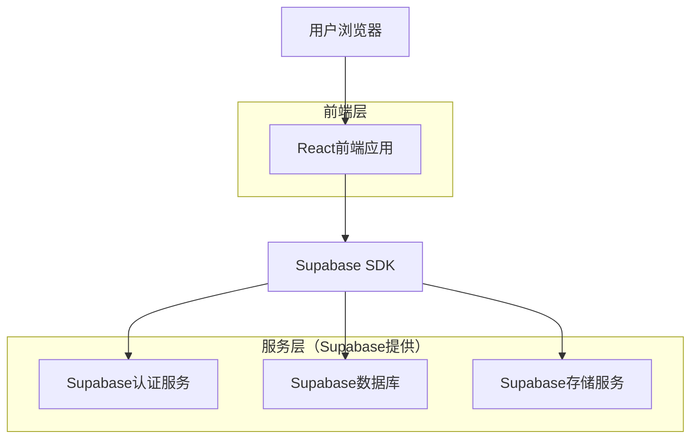
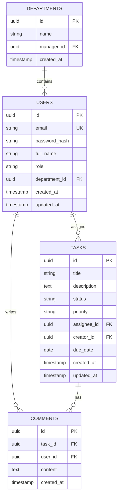

## 1. 架构设计



## 2. 技术描述

- **前端**: React@18 + tailwindcss@3 + vite
- **初始化工具**: vite-init
- **后端**: Supabase（包含认证、数据库、文件存储）
- **UI组件库**: Ant Design@5
- **状态管理**: React Context + useReducer
- **路由**: React Router@6

## 3. 路由定义

| 路由 | 用途 |
|-------|---------|
| /login | 登录页面，用户身份验证 |
| /dashboard | 任务看板，主要工作界面 |
| /task/:id | 任务详情页面，查看和编辑具体任务 |
| /users | 用户管理页面，管理员功能 |
| /statistics | 统计报表页面，数据分析和展示 |
| /profile | 用户个人资料页面 |

## 4. API定义

### 4.1 认证相关API

```
POST /auth/v1/token
```

请求参数：
| 参数名 | 参数类型 | 是否必需 | 描述 |
|-----------|-------------|-------------|-------------|
| email | string | true | 用户邮箱 |
| password | string | true | 用户密码 |

响应参数：
| 参数名 | 参数类型 | 描述 |
|-----------|-------------|-------------|
| access_token | string | JWT访问令牌 |
| token_type | string | 令牌类型 |
| expires_in | number | 令牌有效期（秒） |

### 4.2 任务管理API

```
GET /rest/v1/tasks
```

查询参数：
| 参数名 | 参数类型 | 是否必需 | 描述 |
|-----------|-------------|-------------|-------------|
| select | string | false | 选择字段 |
| status | string | false | 任务状态筛选 |
| assignee_id | uuid | false | 负责人ID筛选 |

```
POST /rest/v1/tasks
```

请求体：
| 参数名 | 参数类型 | 是否必需 | 描述 |
|-----------|-------------|-------------|-------------|
| title | string | true | 任务标题 |
| description | string | false | 任务描述 |
| status | string | true | 任务状态 |
| priority | string | true | 任务优先级 |
| assignee_id | uuid | true | 负责人ID |
| due_date | date | false | 截止日期 |

## 5. 数据模型

### 5.1 数据模型定义



### 5.2 数据定义语言

用户表 (users)
```sql
-- 创建表
CREATE TABLE users (
    id UUID PRIMARY KEY DEFAULT gen_random_uuid(),
    email VARCHAR(255) UNIQUE NOT NULL,
    password_hash VARCHAR(255) NOT NULL,
    full_name VARCHAR(100) NOT NULL,
    role VARCHAR(20) DEFAULT 'employee' CHECK (role IN ('employee', 'manager', 'admin')),
    department_id UUID REFERENCES departments(id),
    created_at TIMESTAMP WITH TIME ZONE DEFAULT NOW(),
    updated_at TIMESTAMP WITH TIME ZONE DEFAULT NOW()
);

-- 创建索引
CREATE INDEX idx_users_email ON users(email);
CREATE INDEX idx_users_department ON users(department_id);
```

任务表 (tasks)
```sql
-- 创建表
CREATE TABLE tasks (
    id UUID PRIMARY KEY DEFAULT gen_random_uuid(),
    title VARCHAR(255) NOT NULL,
    description TEXT,
    status VARCHAR(20) DEFAULT 'pending' CHECK (status IN ('pending', 'in_progress', 'completed')),
    priority VARCHAR(10) DEFAULT 'medium' CHECK (priority IN ('low', 'medium', 'high')),
    assignee_id UUID REFERENCES users(id),
    creator_id UUID REFERENCES users(id),
    due_date DATE,
    created_at TIMESTAMP WITH TIME ZONE DEFAULT NOW(),
    updated_at TIMESTAMP WITH TIME ZONE DEFAULT NOW()
);

-- 创建索引
CREATE INDEX idx_tasks_status ON tasks(status);
CREATE INDEX idx_tasks_assignee ON tasks(assignee_id);
CREATE INDEX idx_tasks_creator ON tasks(creator_id);
CREATE INDEX idx_tasks_due_date ON tasks(due_date);
```

评论表 (comments)
```sql
-- 创建表
CREATE TABLE comments (
    id UUID PRIMARY KEY DEFAULT gen_random_uuid(),
    task_id UUID REFERENCES tasks(id) ON DELETE CASCADE,
    user_id UUID REFERENCES users(id),
    content TEXT NOT NULL,
    created_at TIMESTAMP WITH TIME ZONE DEFAULT NOW()
);

-- 创建索引
CREATE INDEX idx_comments_task ON comments(task_id);
CREATE INDEX idx_comments_user ON comments(user_id);
CREATE INDEX idx_comments_created_at ON comments(created_at DESC);
```

部门表 (departments)
```sql
-- 创建表
CREATE TABLE departments (
    id UUID PRIMARY KEY DEFAULT gen_random_uuid(),
    name VARCHAR(100) UNIQUE NOT NULL,
    manager_id UUID REFERENCES users(id),
    created_at TIMESTAMP WITH TIME ZONE DEFAULT NOW()
);

-- 创建索引
CREATE INDEX idx_departments_manager ON departments(manager_id);
```

### 5.3 访问权限设置

```sql
-- 基本匿名访问权限
GRANT SELECT ON departments TO anon;
GRANT SELECT ON users TO anon;

-- 认证用户完整权限
GRANT ALL PRIVILEGES ON tasks TO authenticated;
GRANT ALL PRIVILEGES ON comments TO authenticated;
GRANT ALL PRIVILEGES ON departments TO authenticated;
GRANT ALL PRIVILEGES ON users TO authenticated;

-- 行级安全策略
ALTER TABLE tasks ENABLE ROW LEVEL SECURITY;
ALTER TABLE comments ENABLE ROW LEVEL SECURITY;
ALTER TABLE users ENABLE ROW LEVEL SECURITY;
ALTER TABLE departments ENABLE ROW LEVEL SECURITY;

-- 任务访问策略
CREATE POLICY "用户只能查看自己的任务或下属任务" ON tasks
    FOR SELECT USING (
        assignee_id = auth.uid() OR 
        creator_id = auth.uid() OR
        EXISTS (
            SELECT 1 FROM users 
            WHERE users.id = auth.uid() 
            AND users.role = 'manager'
            AND users.department_id = (
                SELECT department_id FROM users WHERE id = tasks.assignee_id
            )
        )
    );

CREATE POLICY "管理员可以查看所有任务" ON tasks
    FOR SELECT USING (
        EXISTS (
            SELECT 1 FROM users 
            WHERE users.id = auth.uid() 
            AND users.role = 'admin'
        )
    );
```

## 6. 部署配置

### 6.1 环境变量
```bash
# Supabase配置
VITE_SUPABASE_URL=your_supabase_url
VITE_SUPABASE_ANON_KEY=your_supabase_anon_key

# 应用配置
VITE_APP_NAME=任务管理OA系统
VITE_APP_VERSION=1.0.0
```

### 6.2 构建配置
```json
{
  "build": {
    "outDir": "dist",
    "assetsDir": "assets",
    "sourcemap": false,
    "minify": "terser"
  },
  "server": {
    "port": 3000,
    "host": true
  }
}
```